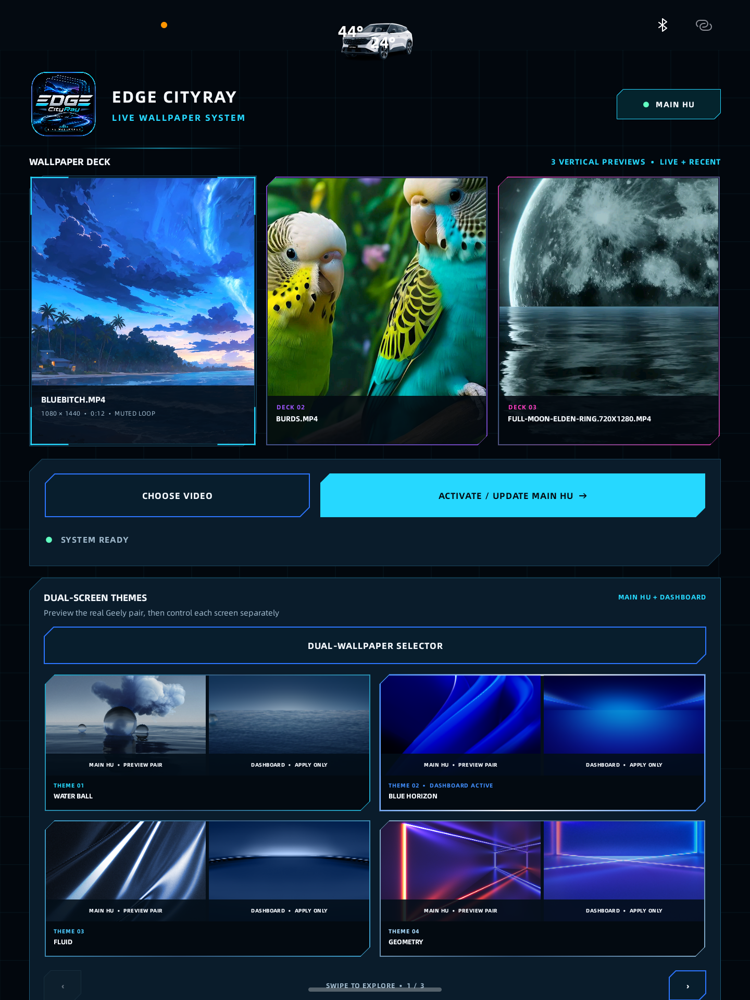
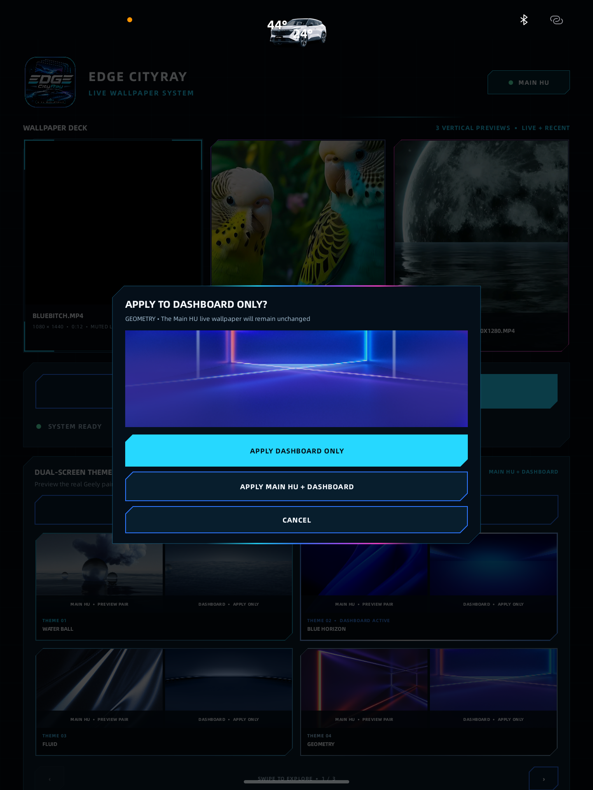
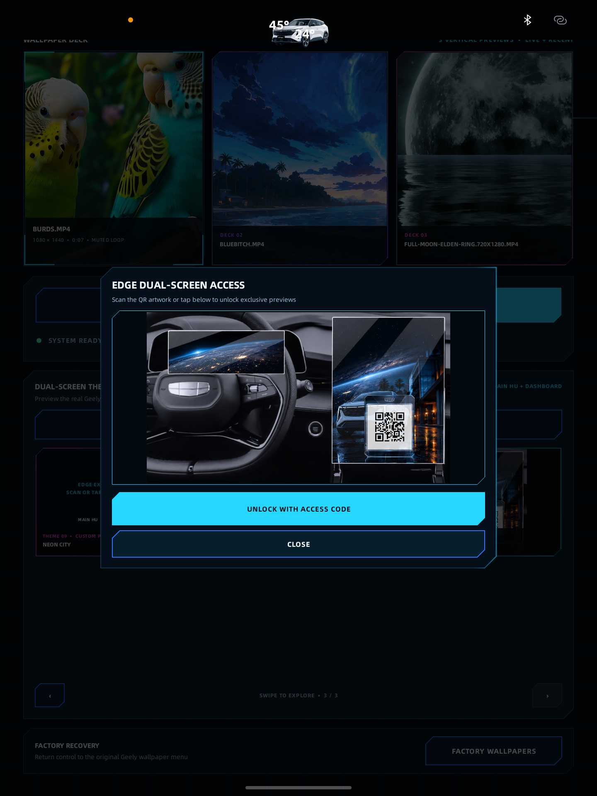
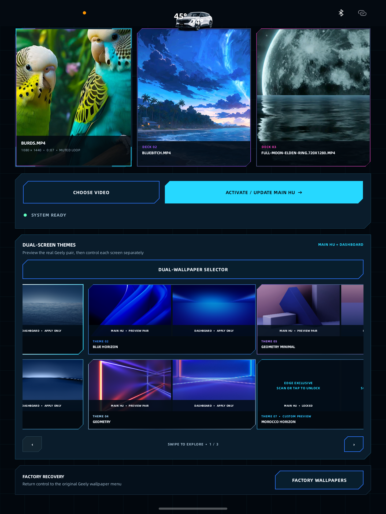

# EDGE CityRay Dual-Wallpaper+Live

An experimental wallpaper controller designed for the Geely CityRay `G426_J1` possibly Atlass head unit. It combines muted looping video wallpapers for the Main HU with Geely factory dual-screen wallpaper controls for the Main HU and driver dashboard.

> [!IMPORTANT]
> **YOU CAN ALWAYS RESET OR SWITCH BACK TO FACTORY WALLPAPERS.** Use the **Factory Wallpapers** recovery button at the bottom of the app to return to the original Geely wallpaper selector.

## Highlights

- Import MP4 videos from USB or HU storage.
- Preview videos with a true center-crop layout before activation.
- Keep three recently applied live wallpapers available for quick selection.
- Browse factory Main HU + dashboard wallpaper pairs.
- Apply a factory pair to both screens or the dashboard only.
- Display factory night artwork in the dual-screen preview deck.
- Protect exclusive custom-theme previews behind a session access screen.
- Return to the original Geely wallpaper interface through Factory Recovery.

## App surface

| Main interface | Factory dual-apply dialog |
| --- | --- |
|  |  |

| Dual-screen access | Locked exclusive previews |
| --- | --- |
|  |  |

## Tested hardware

- Vehicle platform: Geely CityRay
- Head-unit model: `G426_J1`
- Android: 11
- Tested firmware fingerprint family: `qti/ecarx/ecarx`

Other CityRay firmware revisions may use different Geely services, permissions, or wallpaper paths. Test recovery before applying changes on another vehicle.

## Install

The latest build is available here:

[[`release/EDGE_CITYRAY_LIVE_v3.3.3_DUAL_FACTORY_FIX.apk`]([release/EDGE_CITYRAY_LIVE_v3.3.1_DUAL_FACTORY_FIX.apk](https://github.com/AdaMoodz/EDGE-Dual-Wallpaper-Live/releases))](https://github.com/AdaMoodz/EDGE-Dual-Wallpaper-Live/releases)


Install the APK on the HU, allow the requested file access, and open **EDGE CityRay Live**. See [INSTALL.md](INSTALL.md) for the development/test installation notes.

## Build

Requirements:

- Android Studio JBR / Java 17
- Android SDK 35

On Windows:

```powershell
$env:JAVA_HOME = 'C:\Program Files\Android\Android Studio\jbr'
$env:ANDROID_HOME = "$env:LOCALAPPDATA\Android\Sdk"
.\gradlew.bat assembleRelease
```

The APK is generated under `app/build/outputs/apk/release/`.

## Important behavior

- Live video activation and factory static wallpaper application are separate paths.
- Factory dual application stages the Geely day and night CSD assets, invokes the official Geely theme service for the Main HU, then applies the matching dashboard theme.
- Exclusive artwork is not loaded while locked. A fresh app launch starts the exclusive preview area locked again.
- The driver display is safety-relevant. Do not test wallpaper changes while driving.

## Status

Version `3.3.3-dual-factory + live` was built, linted, signature-checked, installed, and exercised on the connected `G426_J1` test HU.

This is an independent experimental project and is not an official Geely application.
